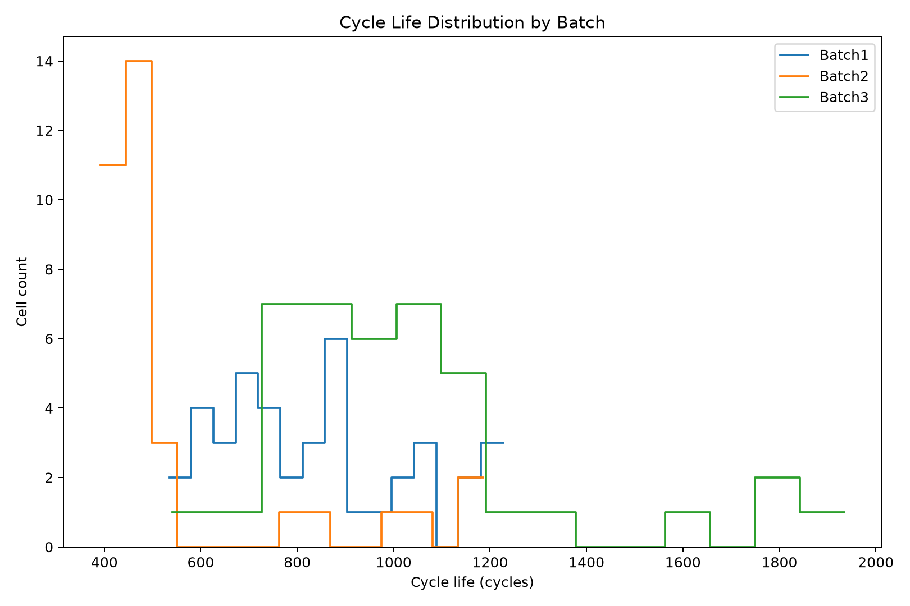
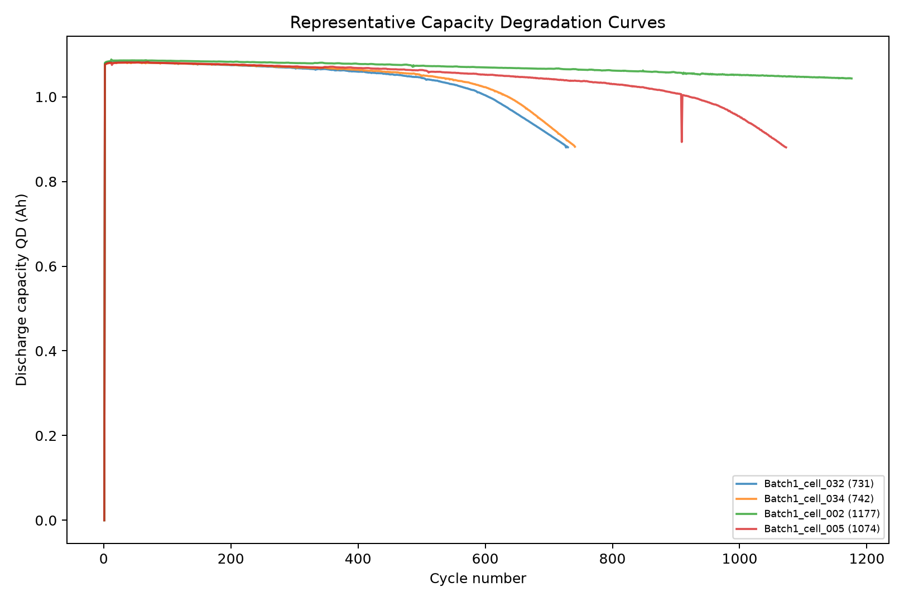
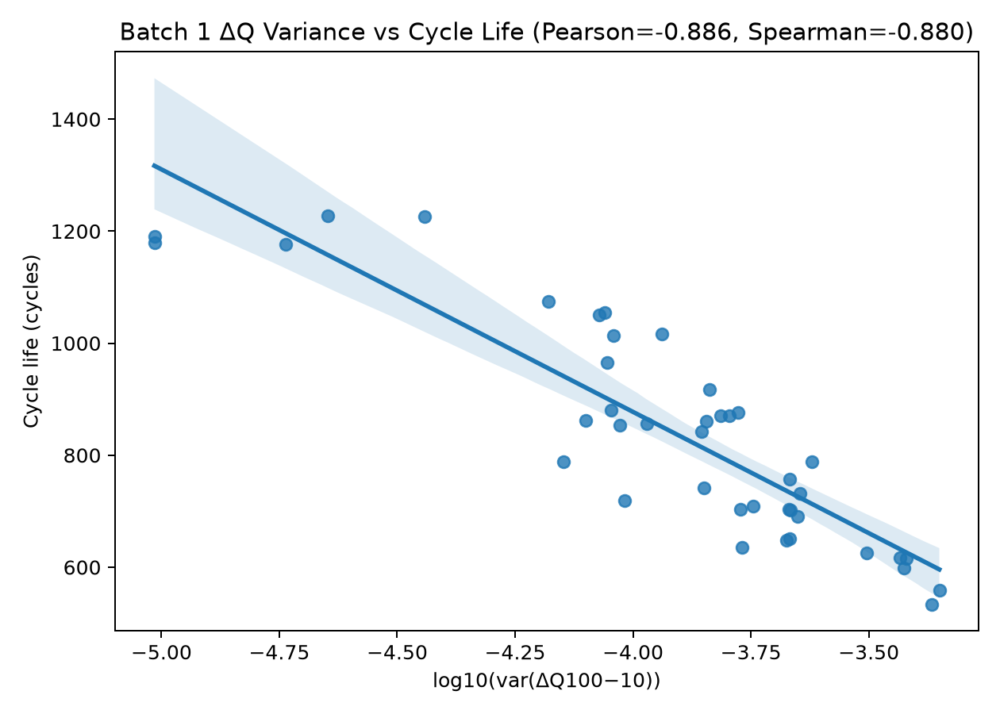
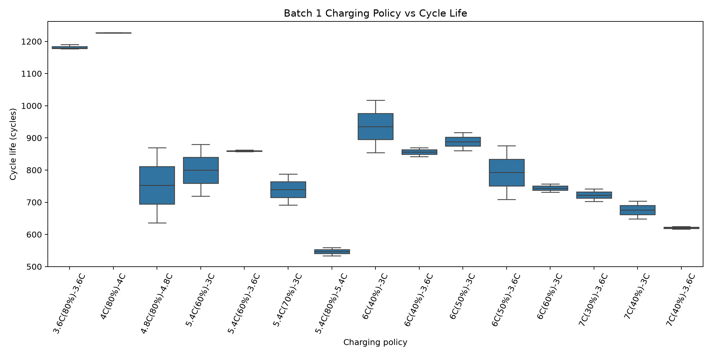
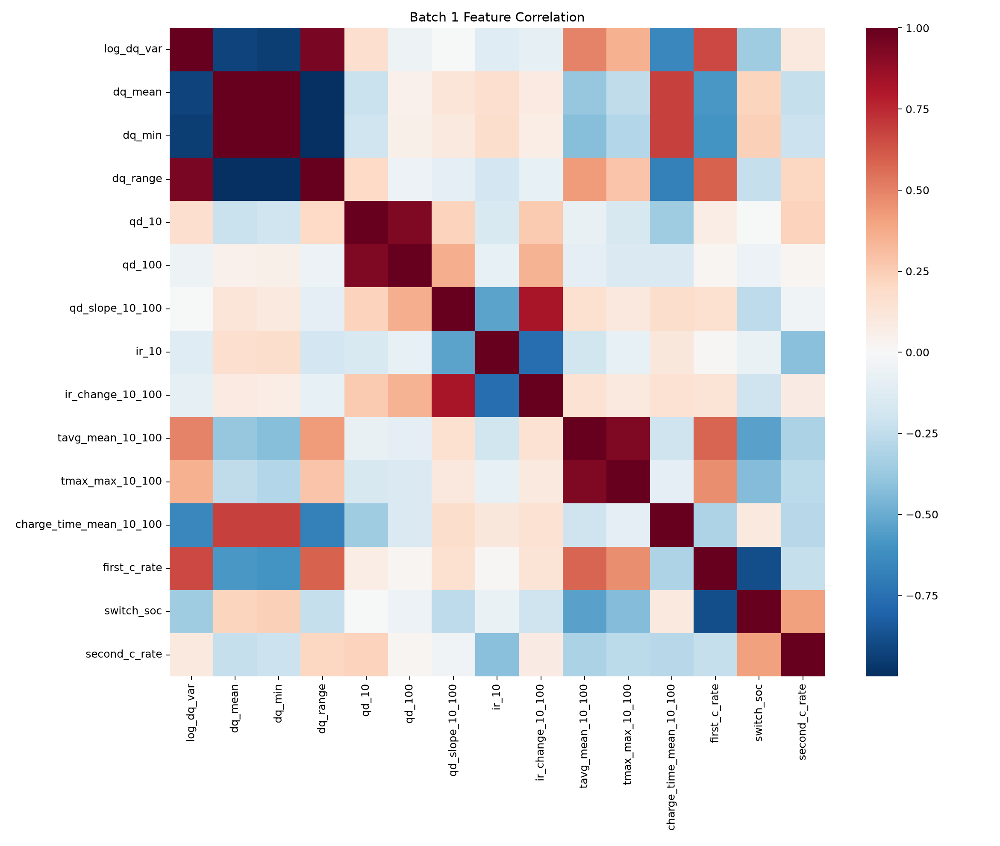

# ESS 배터리 수명 예측

MIT-Stanford Battery Dataset의 초기 100회 충·방전 데이터를 이용해 배터리 Cell의 전체 Cycle Life를 예측하는 프로젝트다. 배터리가 수명 종료에 도달하기 전에 초기 열화 신호를 분석하여 단수명 위험 Cell을 조기에 식별하고, ESS의 예방 정비와 교체 계획에 활용할 수 있는 수명 예측 가능성을 검토한다.

EDA에서 확인한 용량 변화, ΔQ(V), 내부저항, 온도, 충전시간 및 충전 정책을 Cell 단위 Feature로 구성하고, Batch 1에서 모델을 선택한 뒤 Batch 2와 Batch 3에서 외부 일반화 성능을 평가한다.

## 프로젝트 개요

- 데이터셋: MIT-Stanford Battery Dataset (Severson et al., *Nature Energy*, 2019)
- 학습 데이터: Batch 1 (`2017-05-12`)
- 평가 데이터: Batch 2 (`2018-02-20`)
- 추가 평가 데이터: Batch 3 (`2018-04-12`)
- 태스크: **Regression — Cycle Life 예측**
- 목표값: `cycle_life`
- 학습 목표값: `log(cycle_life)`
- 평가지표: 지수 역변환 후 원 Cycle 단위 MAPE(%)

Batch 1은 학습, 교차검증, Hold-out 검증 및 모델 선택에만 사용한다. Batch 2와 Batch 3는 Feature 선택이나 하이퍼파라미터 튜닝에 사용하지 않고 최종 외부 평가에만 사용한다.

원본 Cell은 Batch 1/2/3 각각 46/47/46개다. 저자 공개 전처리 기준에 따라 Batch 1 미도달 Cell 5개, Batch 2 연속 실험 Cell 5개, Batch 3 noisy channel Cell 6개를 제외했다. Batch 2의 목표값 결측 Cell 8개도 제외하여 최종 모델링 가능 Cell은 각각 41/34/40개다. 짧은 수명 자체를 이유로 제외한 Cell은 없다.

## 파일 구조

```text
├── data/
│   └── README.md
├── notebooks/
│   ├── 01_EDA.ipynb
│   ├── 02_feature_engineering.ipynb
│   └── 03_modeling.ipynb
├── src/
│   ├── preprocess.py
│   ├── features.py
│   ├── evaluation.py
│   └── train.py
├── scripts/
│   └── validate_results.py
├── results/
│   ├── figures/
│   ├── tables/
│   ├── feature_dataset_batch1.csv
│   ├── feature_dataset_batch2.csv
│   ├── feature_dataset_batch3.csv
│   └── model_performance.csv
├── reports/
│   ├── DS-MINI-Design-울산_1반-김낙근.pdf
│   └── report_source/
├── requirements.txt
└── README.md
```

## 환경 설정

```bash
git clone https://github.com/asdasd571/DS_MiniProject.git
cd DS_MiniProject
python3 -m venv .venv
source .venv/bin/activate
python -m pip install -r requirements.txt
```

원본 MAT 파일을 준비한 뒤 다음 명령으로 전체 파이프라인을 실행한다.

```bash
python -m src.train \
  --batch1 /path/to/2017-05-12_batchdata_updated_struct_errorcorrect.mat \
  --batch2 /path/to/2018-02-20_batchdata_updated_struct_errorcorrect.mat \
  --batch3 /path/to/2018-04-12_batchdata_updated_struct_errorcorrect.mat \
  --output-dir results
```

결과 파일과 README 수치의 일치 여부는 다음 명령으로 확인할 수 있다.

```bash
python scripts/validate_results.py
```

## EDA

### Cycle Life 분포

- Batch 1/2/3의 Cycle Life 중앙값은 각각 842.0/468.5/964.5 cycles다.
- Batch 2는 500 Cycle 미만 Cell이 76.5%지만 Batch 1에는 500 Cycle 미만 Cell이 없다.
- Batch 3는 1,000 Cycle 초과 Cell이 47.5%다.
- **핵심 발견:** Batch 2는 단수명 방향, Batch 3는 장수명 방향의 분포 이동이 존재하므로 두 Batch를 외부 일반화 평가에 사용해야 한다.



### 열화 곡선 분석

- 장수명 Cell과 단수명 Cell의 초기 QD 곡선은 상당 부분 겹친다.
- Cycle 10의 방전 용량인 `qd_10`과 Cycle Life의 Pearson 상관계수는 0.101로 낮다.
- 초기 100 Cycle 구간에서는 명확한 Knee point를 안정적으로 식별하기 어려워 Knee point를 최종 Feature로 사용하지 않았다.
- Cycle 100 이후의 값은 미래 정보 누수를 막기 위해 Feature에 사용하지 않았다.
- **핵심 발견:** 특정 시점의 용량 절대값보다 초기 구간의 용량 변화량과 열화 추세가 수명 예측에 더 적합하다.



### ΔQ(V) 곡선 분석

- Cycle 10과 Cycle 100의 `Qdlin`을 공통 전압 구간의 1,000개 지점으로 보간한다.
- 각 전압 지점에서 `Q100(V) - Q10(V)`를 계산하여 ΔQ(V) 곡선을 생성한다.
- `log_dq_var`와 Cycle Life의 상관계수는 Pearson -0.886, Spearman -0.880이다.
- ΔQ 파생 Feature인 `dq_std`, `log_dq_var`, `dq_range`, `dq_min`은 Cycle Life와 강한 관계를 보였다.
- **핵심 발견:** 초기 10~100 Cycle 사이의 방전곡선 변화는 장기 Cycle Life를 설명하는 핵심 조기 열화 신호다.



### 충전 속도(C-rate)와 수명의 관계

- 충전 정책 문자열을 `first_c_rate`, `switch_soc`, `second_c_rate`로 분해했다.
- `first_c_rate`와 Cycle Life의 Pearson 상관계수는 약 -0.577이다.
- 정책별 표본 수가 작고 온도, 충전시간 및 다른 운전조건이 함께 작용하므로 상관관계를 인과관계로 해석하지 않았다.
- **핵심 발견:** Cell의 열화 상태뿐 아니라 충전 운전조건도 수명 예측 Feature와 검증 구조에 포함해야 한다.



### Feature 상관관계

- Cycle Life와 강한 Pearson 상관을 보인 Feature는 `dq_std`(-0.896), `log_dq_var`(-0.886), `dq_range`(-0.884), `dq_min`(+0.883)이다.
- ΔQ 파생 Feature끼리도 강한 상관관계가 있어 다중공선성이 존재한다.
- 결측값 보완, Scaling 및 정규화는 Pipeline 내부에서 각 학습 Fold에 대해서만 수행하여 데이터 누수를 방지했다.
- **핵심 발견:** 유사한 열화 Feature를 무작정 늘리기보다 정규화 또는 제한된 모델 복잡도를 사용해야 한다.



## Modeling

### 피처 엔지니어링 전략

EDA 결과를 바탕으로 다음 Feature를 구성했다.

| EDA 관찰 결과 | 해석 | 생성 Feature |
|---|---|---|
| 초기 QD 절대값의 구분력이 낮음 | 특정 값보다 변화량과 변화 속도가 중요 | `qd_10`, `qd_100`, `qd_slope_10_100` |
| ΔQ(V)와 Cycle Life의 관계가 강함 | 초기 방전곡선의 변화 형태가 핵심 열화 신호 | `log_dq_var`, `dq_mean`, `dq_min`, `dq_range` |
| 내부저항 변화가 보조 정보를 제공 | 전기적 상태 변화를 반영 | `ir_10`, `ir_change_10_100` |
| 온도와 충전시간이 열화와 관련 | 초기 운전환경을 반영 | `tavg_mean_10_100`, `tmax_max_10_100`, `charge_time_mean_10_100` |
| 충전 정책별 수명 분포가 다름 | Cell 상태와 운전조건을 함께 고려 | `first_c_rate`, `switch_soc`, `second_c_rate` |

세 Batch에는 동일한 Feature 추출 함수를 적용했다. 목표값은 수명 범위를 안정적으로 다루기 위해 `log(cycle_life)`로 변환하고, 평가는 지수 역변환 후 원래 Cycle 단위에서 수행했다.

### 모델 선택 및 근거

- 후보 모델:
  - Linear Regression: 선형 기준 성능 확인
  - ElasticNet: ΔQ Feature 간 다중공선성과 정규화 대응
  - Gradient Boosting: 비선형 관계 및 Feature 상호작용 비교
- 최종 모델: **Gradient Boosting Regressor**
- 최종 하이퍼파라미터:
  - `learning_rate=0.1`
  - `max_depth=1`
  - `n_estimators=100`
- 선택 이유:
  - ElasticNet의 Batch 1 교차검증 MAPE는 8.10%로 가장 낮았지만, 보지 못한 충전 정책으로 구성한 Hold-out에서 20.58%로 악화됐다.
  - Gradient Boosting은 교차검증 MAPE 10.45%, Hold-out MAPE 8.48%로 새로운 충전 정책에서 가장 좋은 성능을 보였다.
  - Tree 깊이를 1로 제한해 작은 정형 데이터셋에서 복잡도를 억제했다.
  - 약 100개 Cell 규모의 작은 정형 데이터셋이므로 대규모 딥러닝은 과적합 위험 때문에 후보에서 제외했다.

Batch 1은 충전 정책 기반 `GroupShuffleSplit`으로 학습 영역과 Hold-out을 분리하고, 학습 영역에서는 `GroupKFold` 교차검증을 수행했다. 동일한 충전 정책이 학습과 검증에 동시에 포함되는 것을 방지했다.

## 성능 결과

### 후보 모델 비교

| 모델 | Batch 1 CV MAPE | CV 표준편차 | Batch 1 Hold-out MAPE |
|---|---:|---:|---:|
| Linear Regression | 16.95% | 2.95 | 68.36% |
| ElasticNet | **8.10%** | **2.21** | 20.58% |
| Gradient Boosting | 10.45% | 2.57 | **8.48%** |

### 최종 모델 성능

| 구분 | MAPE (%) | 비고 |
|---|---:|---|
| Train (Batch 1 CV) | 10.45% | Batch 1 학습 영역의 GroupKFold 평균 |
| Valid (Batch 1 Hold-out) | 8.48% | 학습에서 보지 못한 충전 정책 |
| Test (Batch 2) | 37.01% | 필수 외부 평가, 튜닝 미사용 |
| Gap (Train-Valid) | -1.98%p | 양수가 클수록 과적합 의심 |
| Gap (Valid-Test) | +28.53%p | 배치 간 일반화 저하 확인 |
| Gap (Target-Test) | +27.91%p | 원논문 Target 9.1% 대비 |
| Test (Batch 3) | 16.93% | 추가 외부 평가, 튜닝 미사용 |
| Gap (Batch2-Batch3) | -20.07%p | Batch 3 MAPE − Batch 2 MAPE |
| Gap (Target-Batch3) | +7.83%p | 원논문 Target 9.1% 대비 |

Batch 1 내부 검증에서는 양호한 성능을 보였지만 Batch 2에서 MAPE가 37.01%로 증가했다. Batch 2는 Batch 1에 없던 500 Cycle 미만 Cell이 많아 외삽 오류가 크게 나타났으며, 현재의 엄격한 Batch 1 전용 학습과 Batch 2 외부평가 조건에서는 논문의 9.1% 수준을 재현하지 못했다. Batch 3 MAPE는 16.93%지만, Batch 2 결과와 비교해 모델을 다시 고르거나 Feature를 수정하지 않았다.

재현 가능한 DAY 2 표와 오류 요약은 `results/DAY2_MODEL_REPORT.md`, `results/tables/day2_performance_report.csv`, `results/tables/day2_error_analysis_summary.csv`에서 확인할 수 있다.

## 오류 분석

- 가장 큰 오류는 실제 수명이 400~500 Cycle인 Batch 2 Cell을 600 Cycle 이상으로 과대예측한 사례에 집중됐다.
- 최대 오류 Cell은 `Batch2_cell_006`이며 실제 수명 393 Cycle, 예측 수명 685 Cycle, 오차율 74.2%였다.
- Batch 1에는 500 Cycle 미만 Cell이 없지만 Batch 2에는 76.5%가 포함되어 있다.
- **원인 가설:** 모델이 학습하지 못한 단수명 영역을 외삽하면서 수명을 지나치게 낙관적으로 예측했다.
- **개선 방향:**
  - 단수명 학습 Cell 확보
  - 학습 분포 밖 입력을 탐지하는 OOD 경고
  - 단일 예측값과 함께 예측구간 제공
  - 논문의 공식 Split 및 Batch continuation 처리와 별도 비교
  - 더 다양한 온도와 충전 정책 데이터를 포함한 외부 검증

Test 결과를 확인한 뒤 현재 Feature나 하이퍼파라미터를 다시 선택하지 않았으며, 외부 테스트의 독립성을 유지했다.

## ESS 도메인 해석

개념적으로 예상 잔여 Cycle은 다음과 같이 계산할 수 있다.

```text
예상 잔여 Cycle ≈ 예측한 전체 Cycle Life - 현재 Cycle
```

실제 BESS에 적용한다면 다음 의사결정을 지원할 수 있다.

- 초기 열화가 빠른 위험 Cell 조기 선별
- 예방 정비와 Cell 교체 시점 계획
- 교체 부품 및 배터리 재고 계획
- ESS 가용성 관리
- Pack 내부 Cell 간 수명 불균형 탐지

다만 현재 모델은 실험실 Cell의 초기 Cycle 데이터로 전체 수명을 예측한 연구용 모델이며, 완전한 현장 RUL 모델은 아니다. 실제 배포를 위해서는 다음 정보와 기능이 추가로 필요하다.

- SOC, SOH 및 Calendar Aging
- 실제 온도와 충·방전 깊이(DoD)
- 휴지시간 및 부하 패턴
- 제조 Lot 차이와 Pack 내부 불균형
- BMS 센서 오차와 결측 대응
- OOD 탐지와 예측 불확실성
- 다양한 현장 운전조건에서의 외부 검증

특히 Batch 2처럼 학습 분포와 다른 환경에서는 단일 예측값만으로 정비를 자동화하면 안 된다.

## 참고문헌

- Severson, K. A. et al. (2019). Data-driven prediction of battery cycle life before capacity degradation. *Nature Energy*, 4, 383–391.
- Severson et al. 공개 데이터 전처리 코드: [Load Data.ipynb](https://github.com/rdbraatz/data-driven-prediction-of-battery-cycle-life-before-capacity-degradation/blob/master/Load%20Data.ipynb)

## 팀 구성

- 김낙근: EDA, 피처 엔지니어링, 모델 개발, Batch 1 검증, Batch 2·3 외부 성능 평가, 오류 분석, ESS 도메인 해석 및 보고서 작성
